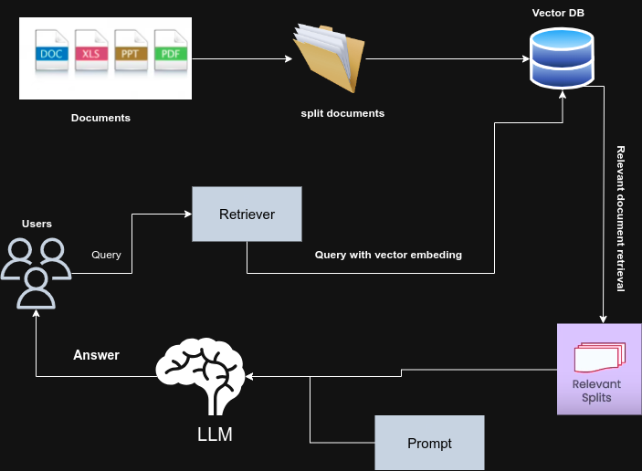

# InfoGPT

You can use the power of a Large Language Model (LLM) along with a vector database to ask questions about your own documents with an interactive GUI based on Streamlit. Currently, it works with the OpenAI API and Llama2 based llm model(only gguf files supported). You can use PDF, TXT, CSV, and DOCX files.

Built with Langchain, LlamaCPP, Streamlit, ChromaDB and Sentence Transformers. Please see the below demo-


https://github.com/himanshu662000/InfoGPT/assets/53088534/85e383b5-2353-4078-ba0e-d5a97450170f


# Getting Started

To get your environment ready for running the code provided here, start by installing all the required dependencies (we recommend using a virtual environment):

```shell
pip install -r requirements.txt
```

### Setting Up .env

I have set up a few environment variables for ease of use. Therefore, you need to configure the necessary environment variables before proceeding to use the GUI.

You can copy the provided example.env as your .env and add your OpenAI API key if you want to use gpt as your llm.

Copy the `example.env` template into `.env`
```shell
cp example.env .env
```
These are the environment variable you can edit:

```
OPENAI_API_KEY=""


#Local LLM Parameter

N_CTX=2048
N_GPU_LAYERS=8
N_BATCH=100

# Vector DB Retriever K

RETRIEVER_K=5


#Document splitting ingest.py 

CHUNK_SIZE=1000
CHUNK_OVERLAP=200

#Embeding Model

EMBEDING_MODEL = "thenlper/gte-base"

```

### Setting Up Local LLM

If you want to use Llama2 based model as your llm, you have to copy your gguf file to model folder of this project. Even though local llm with 7B or 13B are not good as GPT3.5 to provided answer based on context. But I found psmathur/Orcaminiv3 is good enough for my usecases, you can download the gguf file from The Bloke's huggingface page-

| Model Name                  | Hugging Face Link                                       |
|-----------------------------|---------------------------------------------------------|
| TheBloke/orca_mini_v3_7B-GGUF | [Link](https://huggingface.co/TheBloke/orca_mini_v3_7B-GGUF) |
| TheBloke/orca_mini_v3_13B-GGUF | [Link](https://huggingface.co/TheBloke/orca_mini_v3_13B-GGUF) |

Once you copy the gguf file to models folder you are ready to use the GUI.

The beauty of GGUF file is that it supports both CPU and GPU inference. By default if you install dependencies it will work on CPU only but if you want it work on GPU, you have to reinstall llama-cpp-python using below command. Please refer this langchain doc for more reference 
- [Langchain Integration with LLAMAs (LLAMACPP) Documentation](https://python.langchain.com/docs/integrations/llms/llamacpp)

```
CMAKE_ARGS="-DLLAMA_CUBLAS=on" FORCE_CMAKE=1 pip install --upgrade --force-reinstall llama-cpp-python --no-cache-dir
```

### Loading your local Document to Vector Database

Currently, this project supports various file types such as .pdf, .txt, .csv, and .docx, etc. To embed your files into the Vector Database (Chroma), you'll need to copy and paste them into the 'document_sources' folder.

Once you've loaded your file into the 'document_sources' folder of this project, execute the following command to ingest the data into the Vector Database:

```
python3 ingest.py
```

### Running the application through GUI

This project uses Streamlit for frontend GUI, you can run run.py script to launch the application.

```
python3 run.py
```
When you execute this script, the application will launch on a local server, and you can monitor the local server's output in your terminal.

On the left sidebar, you have the option to select either 'Local LLM' or 'OpenAI' as your language model.

If you opt for 'Local LLM' as your language model, it will display an additional dropdown menu containing all the model files available in your local directory. You can make your selection accordingly


# How Does it Work?

This works based on principle of Retrieval Augmentation Generation (RAG) which is an approach in the field of Natural Language Processing (NLP) that combines three key components: retrieval, augmentation, and generation. This approach is designed to improve the performance and capabilities of language models.




Text Spliting and Embeding: In this process, we break down the document's content into smaller units that encapsulate document metadata. After dividing the document into these smaller chunks, we employ a vector embedding model to convert them into representations stored in the vector database.

Retrieval: Retrieval refers to the process of accessing and obtaining specific information or data from a database. It involves searching for and returning relevant items or documents based on user queries or criteria. 

Output Generation: Output Generation occurs after obtaining relevant context from the retriever component. This context is then used as input for the Language Model (LLM), which generates an appropriate response or answer based on the user's query. This step is crucial in providing accurate and contextually relevant responses to user queries. Langchain plays role in chaining the llm, retriever and prompts to give the final answer which we stream through streamlit ui.
